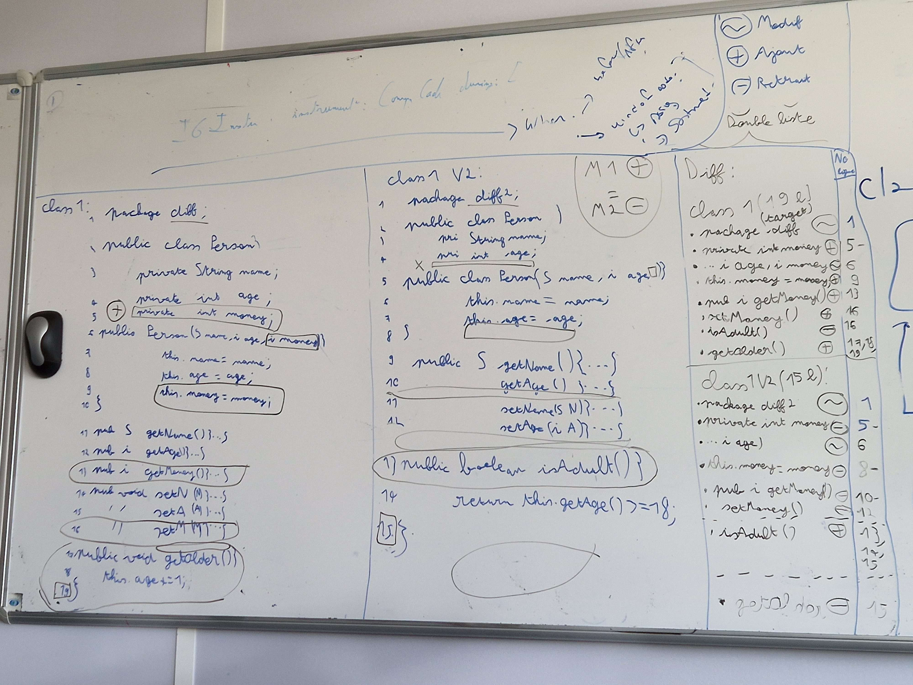
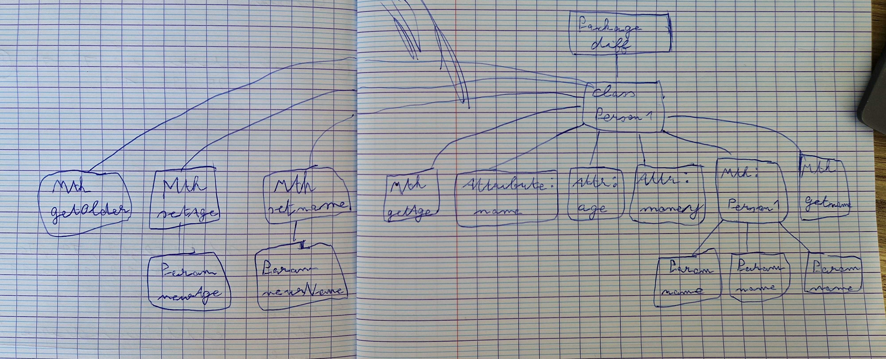

# Idees_Real_Famix_Simpl_Diff

Le but de ce depot est de lister les différentes idées afin de pouvoir implémenter de vraies comparaisons de modifications sur Famix-Simpl-Diff.

# Présentation du contexte

Dans le cadre d'un stage à l'INRIA, j'ai integré l'équipe EVREF afin de travailler sur un outil nommé Famix-Simpl-Diff qui permet de comparer deux modèles de code.

Pour le moment cet outil renvoie uniquement un boolean pour savoir si les deux modèles passés en paramètres sont identiques. 

On ne peut pas vraiment voir les différences qui existe entre les modèles.

## Liste des idées

Pour illustrer les idées exprimés ci-dessous, on peut se référer au schema suivant
.
.

### Remplacer les fails par du vrai comportement
Pour le moment Famix-Simpl-Diff ne parcours pas réelement tout le modèle en cas d'echec. Il va parcourir le modèle et dès qu'il trouve une différence, il appelle fail afin d'arreter l'execution de la recherche de différence.

La première idée ici serait donc de remplacer au maximum les fails par du vrai comportement pour pouvoir afficher les différences. On continue l'exploration des modèles, quand on a une différence, on la recupère, on la stocke dans une liste de différence et on renvoie la liste de différence à la fin.

recap:
- Parcourir les modèles
- Si différence -> recuperer + stocker dans une liste
- A la fin du parcours des modèles, on renvoie la liste des différences

### Différencier la localisation de la différence 

Pour se baser sur ce que fait git diff, il prend un code 1 et un code 2, et il renvoie les lignes qui ont changés. Donc les ajouts et les retraits.

Pour faire ça, il doit y avoir deux listes de différences, un liste qui vient de 1 et un liste qui vient de deux. Il faudra voir comment localiser la différence.

### Les modes d'identification des différences:

Pour le moment j'ai reperé plusieur façon de mettre en lumière des différences:
La target va designer le modèle sur lequel on se base pour interpreter les différences(ajouts/suppression/différences).
- Avec notion de temps: Ce que va faire git diff, c'est mettre la target sur le code le plus recent que l'utilisateur est entrain d'écrire. Donc en se basant sur cela, on regarde les modifs qui ont été faites comparé au code plus vieux et on base l'analyse sur cela. 

- Choisir manuellement la target -> on va choisir nous meme le modele sur lequel on va se baser pour interpreter la différence.
- Fonctionnement sans target -> On peut egalement faire un mode sans target. Dans ce cas, les deux modèles comparés aurait chacun leurs propre liste de différence, et l'interpretation dependrait de l'utilisateur

### Utiliser une ou plusieur liste de différences
Pour continuer directement le point précédent, pour etablir une liste de différence, il faut alors savoir si on va créer une liste de différence par modèle, ou alors une liste de différence générale, qui dépendrais du choix de la target(manuelle, temps, autre).

### La gestion des evenement mirror entre ajout/suppression
Dependant de l'implémentation choisie, les différences changeront selon la target que l'on a définie. Par exemple si dans le modèle 1, on a l'ajout d'une ligne, alors dans le modèle 2 cela correspond a une suppression, et inversement.

# Liste des taches à faire

## 1) Mettre en place la structure de données pour representer une différence. (TODO)

Avant de pouvoir etablir une liste de différence, nous avons besoin d'une classe qui va représenter cette différence.

On va donc devoir créer une classe Famix-Difference ou autre nom afin de pouvoir créer des objets qui vont representer des différences.

Dans cette classe on aura par exemple comme variable d'instance:
- l'entité 
- Le type de différence(ajout/suppression/modification)
- La target (a voir)
- Ce qui a changé(ce qu'on voulait => ce qu'on a eu)

## 2) Ajouter la liste des différences dans Famix-Simpl-Diff (TODO)

Il nous faut quelque part ou ranger la liste des différences que l'on trouve au fur et a mesure.
Il faudrait ajouter une variable d'instance différence pour pouvoir stocker ces différences.

## 3) Remplacer les fails par les ajouts de différences, on ne doit plus s'arreter a la moindre différence (TODO)

Comme on l'a vu précédement, pour le moment FamixSimplDiff s'arrete dès qu'il trouve une différence entre deux modèles. Il faudrait maintenant remplacer tout les cas ou on a un fail par une logique d'ajout de nos différences dans la liste creée précédement.

Il faudrait ajouter une methode recordDifference pour povoir enregistrer une différence dans la liste de différence (sorte de add pour les liste mais avec une différence). 

Une fois record difference créee, on fait des appels a cette methode au lieu de renvoyer des fails.

## 4) Gerer la gestion de suppression et d'ajout (TODO)
Il faudra voir comment ajouter la gestion des ajout et suppression d'entité.
Ce cas va se produire sur des listes d'entités de taille différentes(par exemple avec l'ajout d'une méthode dans une classe d'un modèle).

Il y aura donc deux cas concrets( dans la cas ou le modèle 2 est la target):

- Suppression -> Si une entité est présente dans le modèle 1 mais pas dans le 2, elle a été suprrimée du modèle 2.
- Ajout -> Si une entité est présente dans le modèle 2 mais pas dans le modèle 1, elle a été ajoutée dans le modèle 1.

Voir la gestion des parents dans ces cas, mais également la gestion des miroirs(ajout dans modele 1 = suppression dans le modèle 2).

## 5) Mettre a jour le retour pour renvoyer la liste de différence en plus du boolean (TODO)

Une fois les étapes précedentes réalisées, il faudar finalement mettre a jour les méthodes comme compareModel:to: pour renvoyer la liste de différence en plus du booleen qui indique si les modèles sont équivalents ou non.